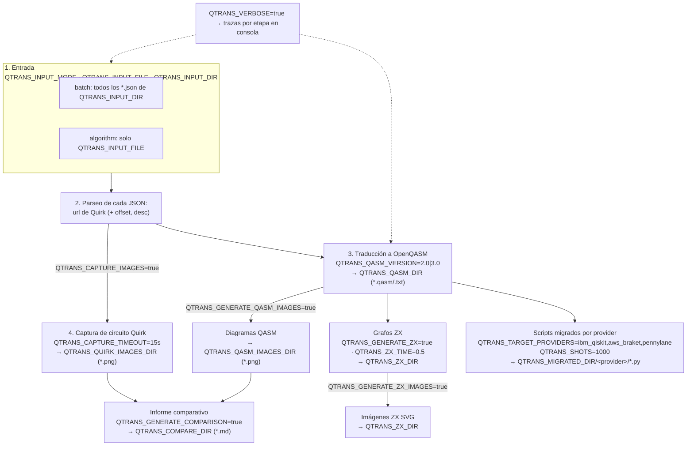

# QTransLIFIA

QTransLIFIA es un proyecto cuyo objetivo es la traducción de circuitos cuánticos desde [Quirk](https://algassert.com/quirk) a cualquier ecosistema objetivo ([IBM Qiskit](https://www.ibm.com/quantum/qiskit), [AWS Braket](https://aws.amazon.com/braket/getting-started/) o [Pennylane](https://pennylane.ai/codebook/pennylane-fundamentals)) utilizando como lenguaje "pivote" de representación intermedia a [OpenQASM](https://openqasm.com/language/standard_library.html) y ofrece dos formas de trabajo: un pipeline Python/CLI y cuadernos Jupyter para exploración, visualización y migración a otros frameworks o ecosistemas de desarrollo cuántico.

## Estructura

```text
.
├── input/                                # JSON de entrada del CLI
├── notebooks/
│   ├── input/                            # JSON de entrada usados por los cuadernos
│   ├── output/                           # Salidas agrupadas por corrida (no versionado)
│   │   └── run_DD_MM_YYYY__HH/           # Una carpeta por fecha y hora (sin minutos)
│   │       ├── algorithms_qasm/          # Algoritmos traducidos a OpenQASM (.txt)
│   │       ├── imgs/                     # Imágenes (.png) de la corrida
│   │       │   ├── circuits_quirk/       # Capturas PNG de los circuitos originales
│   │       │   └── circuits_qasm/        # Diagramas PNG de los circuitos OpenQASM
│   │       ├── circuits/                 # Scripts Python migrados por ecosistema
│   │       │   ├── qiskit/
│   │       │   ├── aws_braket/
│   │       │   └── pennylane/
│   │       ├── compare/                  # Informes Markdown de comparación visual (.md)
│   │       └── ZXCalculus/               # Equivalencia con cálculo ZX
│   │           ├── algorithms_base/      # Grafos ZX construidos desde Quirk
│   │           ├── algorithms_qasm/      # Grafos ZX construidos desde OpenQASM
│   │           └── graphs/               # Diagramas SVG de los grafos
│   └── QTrans_LIFIA_algorithms_jose.ipynb  # Notebook con la lógica del pipeline (traducción y comparación)
├── output/                               # Salidas del CLI (estructura plana, configurable vía QTRANS_*DIR)
├── utils/qutils.py                       # Traducción Quirk/OpenQASM, grafos ZX y captura
├── qtrans.py                             # API Python y CLI del pipeline
├── translator.py                         # API HTTP heredada
├── requirements.txt                      # Librerías requeridas por el proyecto
└── requirements_original.txt             # Librerías originales requeridas por el proyecto
```

### Estampa de corrida (`run_DD_MM_YYYY__HH`)

En el flujo del **cuaderno Jupyter**, todas las salidas se agrupan bajo `output/run_<estampa>/`, donde `<estampa>` es la fecha y la **hora** en que se inicia la ejecución, **sin minutos** (`DD_MM_YYYY__HH`, p. ej. `run_10_10_2026__13`).

- Ejecutar el flujo varias veces **dentro de la misma hora** reutiliza el mismo directorio y **sobrescribe** los archivos generados, evitando crear una carpeta nueva por cada reintento.
- Al cambiar la hora se crea una nueva carpeta `run_*`, preservando el historial de corridas anteriores.
- Las carpetas generadas están excluidas del control de versiones (`.gitignore`: `/output/` y `/notebooks/output/`).

El **CLI** (`qtrans.py`) no usa la estampa de corrida: escribe en los directorios configurados por las variables `QTRANS_*DIR` (por defecto, `notebooks/output`, `notebooks/algorithms_qasm`, `notebooks/ZXCalculus`, etc.).

Los cuadernos mantienen sus datos y resultados dentro de `notebooks/`. Por defecto el CLI también usa `notebooks/input` y `notebooks/output`; las carpetas `input/` y `output/` de la raíz pueden configurarse vía `.env` o CLI.

### Versión de OpenQASM en el cuaderno

La celda de generación de QASM está parametrizada por la variable `QASM_VERSION` (defecto `'3.0'`, acepta `'2.0'`). Cada archivo OpenQASM se escribe en `.../algorithms_qasm` con el sufijo de versión, por ejemplo `1__Shor_v3.0.txt` o `1__Shor_v2.0.txt`, lo que permite que ambas versiones coexistan en el mismo directorio de corrida. Las celdas de imágenes, grafos ZX y migración procesan **solo** los `.txt` de la versión activa (filtran por `QASM_VERSION_SUFFIX`, igual a `_v3.0` por defecto) y quitan el sufijo al derivar sus nombres, por lo que sus artefactos conservan el nombre sin versión y las comparaciones siguen funcionando igual.

## Instalación

Se recomienda Python 3.12, que es la versión usada en el entorno de desarrollo.

Generación del entorno de ejecución:
```bash
python -m venv .venv
```

Activación del entorno:

```bash
# Windows PowerShell
.venv\Scripts\Activate.ps1

# macOS / Linux
source .venv/bin/activate
```

Instalacion de dependencias requeridas:

```bash
python -m pip install -r requirements.txt
```

Para capturar circuitos Quirk como PNG se necesita Chrome o Chromium disponible en el equipo. Selenium inicia el navegador en modo headless.

## Configuración

El CLI carga `.env` desde la raíz del proyecto. Plantilla base: `.env.example` (cópiala como `.env` para configuración local).

```dotenv
QTRANS_INPUT_MODE=batch
QTRANS_INPUT_FILE=
QTRANS_INPUT_DIR=notebooks/input
QTRANS_OUTPUT_DIR=notebooks/output
QTRANS_QASM_DIR=notebooks/algorithms_qasm
QTRANS_VISUAL_DIR=/output/imgs
QTRANS_QUIRK_IMAGES_DIR=/output/imgs/circuits_quirk
QTRANS_QASM_IMAGES_DIR=/output/imgs/circuits_qasm
QTRANS_COMPARE_DIR=notebooks/compare
QTRANS_ZX_DIR=notebooks/ZXCalculus
QTRANS_MIGRATED_DIR=notebooks/output/migrated_circuits
QTRANS_CAPTURE_IMAGES=true
QTRANS_GENERATE_QASM_IMAGES=true
QTRANS_GENERATE_COMPARISON=true
QTRANS_GENERATE_ZX=true
QTRANS_GENERATE_ZX_IMAGES=true
QTRANS_VERBOSE=false
QTRANS_QASM_VERSION=3.0
QTRANS_ZX_TIME=0.5
QTRANS_SHOTS=1000
QTRANS_CAPTURE_TIMEOUT=15
QTRANS_TARGET_PROVIDERS=ibm_qiskit
```

Todas las rutas relativas se resuelven desde la raíz del proyecto. Los valores de arriba son los defaults incorporados en `qtrans.py`; `.env` permite cambiarlos para la ejecución local y `.env.example` sirve como plantilla compartible.

| Variable                      | Utilización                                                                                                    | Default                                    |
| ----------------------------- | -------------------------------------------------------------------------------------------------------------- | ------------------------------------------ |
| `QTRANS_INPUT_MODE`           | `batch` procesa todos los JSON del directorio; `algorithm` procesa un solo archivo.                            | `batch`                                    |
| `QTRANS_INPUT_FILE`           | Archivo JSON seleccionado en modo `algorithm`; puede pasarse también por CLI.                                   |                                            |
| `QTRANS_INPUT_DIR`            | Directorio de JSON de entrada.                                                                                 | `notebooks/input`                          |
| `QTRANS_OUTPUT_DIR`           | Raíz de los resultados del pipeline.                                                                           | `notebooks/output`                         |
| `QTRANS_QASM_DIR`             | Archivos OpenQASM generados.                                                                                   | `notebooks/algorithms_qasm`                |
| `QTRANS_VISUAL_DIR`           | Raíz de las imágenes (`.png`/`.jpg`); contiene los subdirectorios `circuits_quirk`, `circuits_qasm` y `circuits_quirk_original`. | `/output/imgs`                             |
| `QTRANS_QUIRK_IMAGES_DIR`     | Capturas PNG de Quirk (default relativo a `QTRANS_VISUAL_DIR`).                                                | `/output/imgs/circuits_quirk`              |
| `QTRANS_QASM_IMAGES_DIR`      | Diagramas PNG de los circuitos OpenQASM (default relativo a `QTRANS_VISUAL_DIR`).                              | `/output/imgs/circuits_qasm`               |
| `QTRANS_COMPARE_DIR`          | Informes Markdown de comparación visual.                                                                       | `notebooks/compare`                        |
| `QTRANS_ZX_DIR`               | Grafos, comparativas e imágenes ZX.                                                                            | `notebooks/ZXCalculus`                     |
| `QTRANS_MIGRATED_DIR`         | Raíz de los scripts por provider; crea un subdirectorio por provider.                                          | `notebooks/output/migrated_circuits`       |
| `QTRANS_TARGET_PROVIDERS`     | Lista separada por comas: `ibm_qiskit`, `aws_braket`, `pennylane`.                                             | `ibm_qiskit`                               |
| `QTRANS_QASM_VERSION`         | Formato fuente generado: `2.0` o `3.0`.                                                                        | `3.0`                                      |
| `QTRANS_CAPTURE_IMAGES`       | Activa capturas de Quirk. Booleano (`true/false`, `yes/no`, `on/off`, `1/0`).                                 | `true`                                     |
| `QTRANS_GENERATE_QASM_IMAGES` | Activa diagramas de los circuitos QASM. Booleano.                                                              | `true`                                     |
| `QTRANS_GENERATE_COMPARISON`  | Activa páginas de comparación Quirk/QASM. Booleano.                                                            | `true`                                     |
| `QTRANS_GENERATE_ZX`          | Activa conversión y comparación de grafos ZX. Booleano.                                                        | `true`                                     |
| `QTRANS_GENERATE_ZX_IMAGES`   | Activa diagramas SVG de grafos ZX. Booleano.                                                                   | `true`                                     |
| `QTRANS_VERBOSE`              | Muestra el resultado de cada etapa del pipeline. Booleano.                                                     | `false`                                    |
| `QTRANS_ZX_TIME`              | Snapshot temporal Quirk para gates como `Rxft`, en el rango `0..1`.                                            | `0.5`                                      |
| `QTRANS_SHOTS`                | Número de shots para los QNodes PennyLane con mediciones. Entero positivo.                                     | `1000`                                     |
| `QTRANS_CAPTURE_TIMEOUT`      | Timeout de carga/captura del navegador Selenium, en segundos. Entero positivo.                                 | `15`                                       |

Coloca en `QTRANS_INPUT_DIR` (`notebooks/input/` por defecto) uno o más archivos `.json`. Cada archivo debe ser un objeto cuyas claves son nombres de algoritmos y cuyos valores incluyen una URL de Quirk:

```json
{
	"1. Ejemplo": {
		"url": "https://algassert.com/quirk#circuit=...",
		"offset": 0,
		"desc": "Descripción opcional"
	}
}
```

En cuanto a las parametrizaciones:

`url` es obligatorio; `offset` y `desc` son opcionales. El modo batch procesa los JSON del primer nivel de `QTRANS_INPUT_DIR` (no busca recursivamente). Si el nombre del archivo es `popular_algorithms.json`, los nombres de salida llevan el prefijo `popular_`.

## CLI

Ejecuta los comandos desde la raíz del repositorio.

Procesar todos los JSON de `QTRANS_INPUT_DIR`:

```bash
python qtrans.py --input-mode batch
```

Procesar un único JSON:

```bash
python qtrans.py --input-mode algorithm --input-file algorithms.json
```

`--input-file` acepta un nombre relativo a `QTRANS_INPUT_DIR`, una ruta relativa al directorio actual o una ruta absoluta. Las opciones `--input-dir`, `--qasm-dir` y `--quirk-images-dir` permiten reemplazar las rutas configuradas.

Omitir las capturas PNG:

```bash
python qtrans.py --input-mode batch --no-capture
```

Forzar capturas aunque `.env` tenga `QTRANS_CAPTURE_IMAGES=false`:

```bash
python qtrans.py --input-mode batch --capture-images
```

Para consultar todos los argumentos:

```bash
python qtrans.py --help
```

El resultado es OpenQASM (según `QTRANS_QASM_VERSION`, `3.0` por defecto) en `QTRANS_QASM_DIR` (`notebooks/algorithms_qasm/` por defecto) y, cuando las capturas están activas, imágenes PNG en `QTRANS_QUIRK_IMAGES_DIR` (`output/imgs/circuits_quirk/` por defecto, derivado de `QTRANS_VISUAL_DIR`). Los errores de captura se contabilizan y no cancelan la conversión del JSON.

## Flujo de Ejecución

Pipeline que ejecuta el CLI/API, indicando qué genera cada parametrización:



Resumen de generaciones activables por parámetro:

| Parámetro | Valor | Artefacto generado |
| --- | --- | --- |
| `QTRANS_QASM_VERSION` | `2.0` / `3.0` | Código OpenQASM en `QTRANS_QASM_DIR` |
| `QTRANS_CAPTURE_IMAGES` | `true/false` | PNG de Quirk en `QTRANS_QUIRK_IMAGES_DIR` |
| `QTRANS_GENERATE_QASM_IMAGES` | `true/false` | PNG de circuitos QASM en `QTRANS_QASM_IMAGES_DIR` |
| `QTRANS_GENERATE_COMPARISON` | `true/false` | Informes `.md` en `QTRANS_COMPARE_DIR` |
| `QTRANS_GENERATE_ZX` | `true/false` | Grafos ZX y análisis en `QTRANS_ZX_DIR` |
| `QTRANS_GENERATE_ZX_IMAGES` | `true/false` | SVG de grafos ZX en `QTRANS_ZX_DIR` |
| `QTRANS_TARGET_PROVIDERS` | `ibm_qiskit`, `aws_braket`, `pennylane` | Scripts Python migrados en `QTRANS_MIGRATED_DIR/<provider>/` |

Los errores de captura o de alguna etapa no cancelan las demás generaciones: se contabilizan en el resumen final.

## Uso Como Librería

`qtrans.py` también expone `run_pipeline` para integrar la traducción en código Python:

```python
from qtrans import run_pipeline

batch_result = run_pipeline(input_mode="batch")
single_result = run_pipeline(
		input_mode="algorithm",
		input_file="algorithms.json",
		capture_images=False,
)
```

La función devuelve un resumen con los archivos procesados, algoritmos, archivos QASM, capturas y errores. También se puede pasar `input_dir`, `qasm_dir` y `quirk_images_dir` como argumentos.

## Cuadernos Jupyter

Los cuadernos se conservan como flujo alternativo e independiente del CLI. Abre `notebooks/QTrans_LIFIA_algorithms_jose.ipynb`, selecciona un kernel con las dependencias instaladas y ejecuta las celdas en orden. La primera celda verifica e instala los paquetes necesarios en el kernel.

El cuaderno principal lee `notebooks/input/algorithms.json` y `notebooks/input/popular_algorithms.json` y escribe todas sus salidas bajo una única carpeta de corrida `notebooks/output/run_DD_MM_YYYY__HH/` (fecha y hora sin minutos):

- `algorithms_qasm/` — QASM traducido
- `imgs/circuits_quirk/` y `imgs/circuits_qasm/` — diagramas PNG
- `compare/` — informes Markdown de comparación visual
- `ZXCalculus/{algorithms_base,algorithms_qasm,graphs}/` — grafos ZX y SVG
- `circuits/qiskit/`, `circuits/aws_braket/`, `circuits/pennylane/` — scripts migrados

Cada celda imprime en su log el directorio de la corrida (`DIRECTORIO DE LA CORRIDA: ...`) para ubicar los artefactos. Las celdas de migración leen los archivos OpenQASM de la carpeta `algorithms_qasm/` de esa misma corrida.

Los scripts Braket requieren `amazon-braket-sdk`; los scripts PennyLane requieren `pennylane`.

## API HTTP Heredada

`translator.py` conserva la API Flask usada por las integraciones existentes. Se inicia con:

```bash
python translator.py
```

El servidor escucha en `http://localhost:8081`. Endpoints POST disponibles:

- `/code/ibm` y `/code/ibm/individual`
- `/code/aws` y `/code/aws/individual`
- `/code/qasm` y `/code/qasm/individual`

La colección de Postman está en `postman/Quirk_Translator_IBM_AWS.postman_collection_original.json`.

## Pruebas Unitarias del proyecto

Ejecuta la suite del pipeline con:

```bash
python -m unittest discover -s test -p "test_*.py" -v
```
