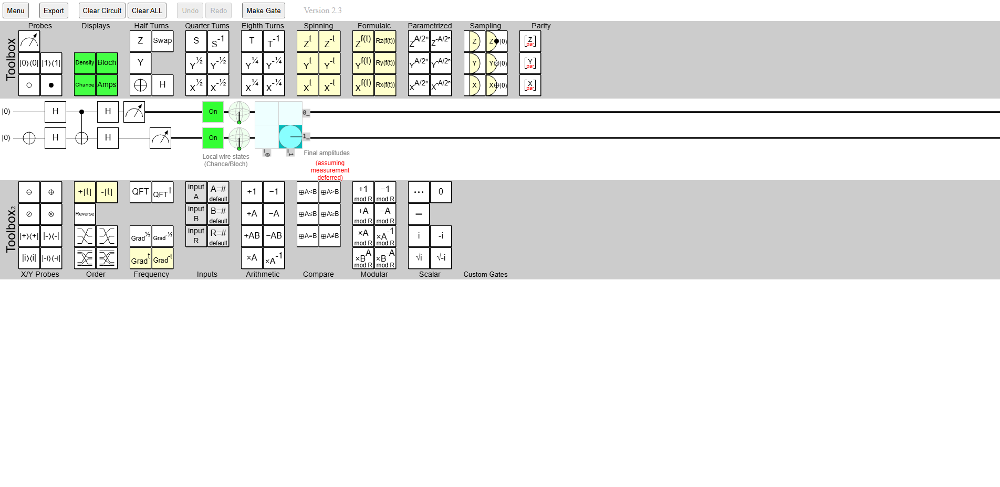
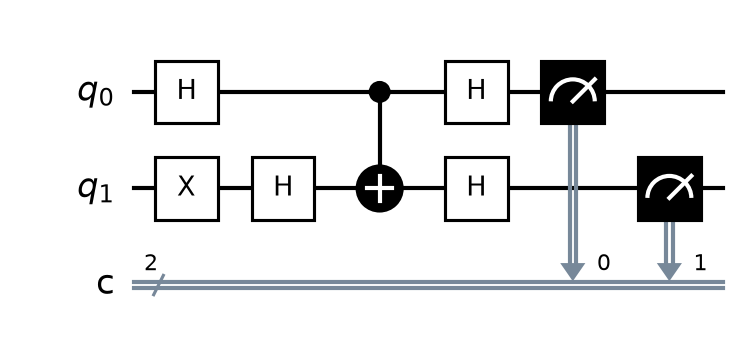

# Comparación: 11  Kickback

<table>
<tr><th align="center">Circuito Original (Quirk)</th><th align="center">Circuito traducido (OpenQASM 3.0)</th></tr>
<tr>
<td align="center"></td>
<td align="center"></td>
</tr>
</table>
