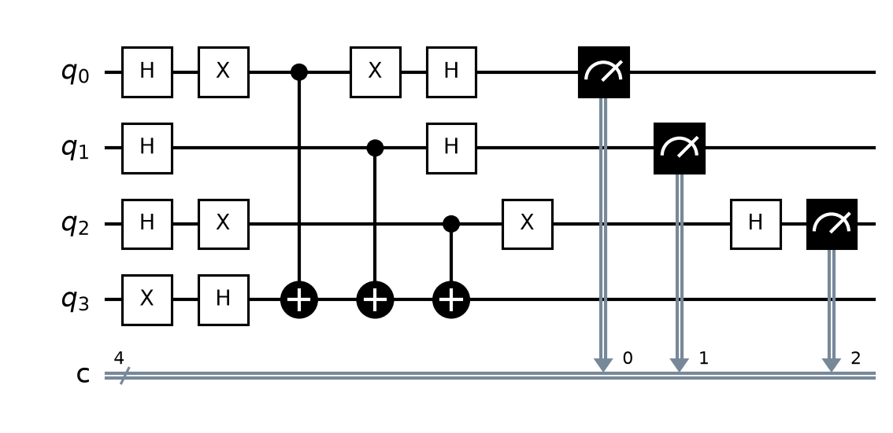

# Comparación: 4  Deutsch-Jozsa

<table>
<tr>
<td align='center'><b>OpenQASM 3.0</b> </td>
<td align='center'><b>Quirk</b> </td>
</tr>
</table>

Archivo QASM: `4__Deutsch-Jozsa.png`
Archivo Quirk: `4__Deutsch-Jozsa.png`